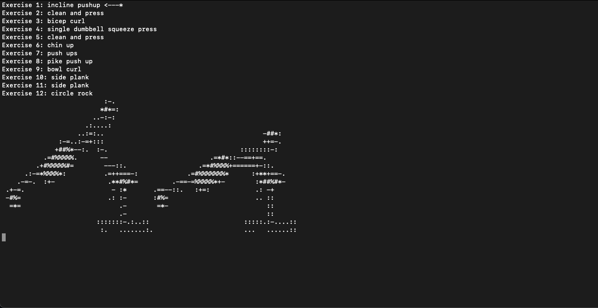

<!--
*** Thanks for checking out the Best-README-Template. If you have a suggestion
*** that would make this better, please fork the command-line-personal-trainer and create a pull request
*** or simply open an issue with the tag "enhancement".
*** Thanks again! Now go create something AMAZING! :D
***
***
***
*** To avoid retyping too much info. Do a search and replace for the following:
*** bay1877, command-line-personal-trainer, bay1877@rit.edu, Command Line Personal Trainer
-->


<!-- PROJECT SHIELDS -->
<!--
*** I'm using markdown "reference style" links for readability.
*** Reference links are enclosed in brackets [ ] instead of parentheses ( ).
*** See the bottom of this document for the declaration of the reference variables
*** for contributors-url, forks-url, etc. This is an optional, concise syntax you may use.
*** https://www.markdownguide.org/basic-syntax/#reference-style-links
-->
[![Contributors][contributors-shield]][contributors-url]
[![Forks][forks-shield]][forks-url]
[![Stargazers][stars-shield]][stars-url]
[![Issues][issues-shield]][issues-url]
[![MIT License][license-shield]][license-url]
[![LinkedIn][linkedin-shield]][linkedin-url]


<!-- PROJECT LOGO -->
<br />
<p align="center">
  <a href="https://github.com/bay1877/command-line-personal-trainer">
    
  </a>

  <h3 align="center">Command Line Personal Trainer</h3>

  <p align="center">
    Automatically generated workouts right on your command line
    <br />
    <a href="https://github.com/bay1877/command-line-personal-trainer"><strong>Explore the docs »</strong></a>
    <br />
    <br />
    <a href="https://github.com/bay1877/command-line-personal-trainer/issues">Report Bug</a>
    ·
    <a href="https://github.com/bay1877/command-line-personal-trainer/issues">Request Feature</a>
  </p>
</p>


<!-- TABLE OF CONTENTS -->
<details open="open">
  <summary><h2 style="display: inline-block">Table of Contents</h2></summary>
  <ol>
    <li>
      <a href="#about-the-project">About The Project</a>
      <ul>
        <li><a href="#built-with">Built With</a></li>
      </ul>
    </li>
    <li>
      <a href="#getting-started">Getting Started</a>
      <ul>
        <li><a href="#prerequisites">Prerequisites</a></li>
        <li><a href="#installation">Installation</a></li>
      </ul>
    </li>
    <li><a href="#usage">Usage</a></li>
    <li><a href="#roadmap">Roadmap</a></li>
    <li><a href="#contributing">Contributing</a></li>
    <li><a href="#license">License</a></li>
    <li><a href="#contact">Contact</a></li>
    <li><a href="#acknowledgements">Acknowledgements</a></li>
  </ol>
</details>


<!-- ABOUT THE PROJECT -->
## About The Project

This project was born in 2020 during times of quarantine and social-distancing. Gyms were closed, and motivation to stay fit was low. This project aimed to both help me generate at-home workouts and help me stay motivated toward fitness/health.

Command Line Personal Trainer provides a command line interface that generates and guides the user through a variety of different workouts. Many workouts require very little to no equipment.

### Built With

* [pyttsx3](https://pypi.org/project/pyttsx3/)
* [cv2](https://pypi.org/project/opencv-python/)
* [numpy](https://pypi.org/project/numpy/)
* [argparse](https://docs.python.org/3/library/argparse.html)
* [random](https://docs.python.org/3/library/random.html)
* [time](https://docs.python.org/3/library/time.html)
* [os](https://docs.python.org/3/library/os.html)

<!-- GETTING STARTED -->
## Getting Started

To get a local copy up and running follow these simple steps.

### Prerequisites

This project assumes you have python installed.

### Installation

1. Clone the repo
   ```sh
   git clone https://github.com/bay1877/command-line-personal-trainer.git
   ```
2. Enter the repo directory
   ```sh
   cd WorkoutGenerator
   ```
2. Setup and enter the virtual environment.
   ```sh
   python3 -m venv venv
   source ./venv/bin/activate
   ```
3. Install Python packages
   ```sh
   pip install -r requirements.txt
   ```

### MP3 Players
Different operating systems use different command line mp3/audio players. *TTS.py* currently supports MacOS; change `os.system("afplay *")` calls to match your OS. 

##### Mac OS
Use `afplay`.

##### Linux
Try `mpg123`.

##### Windows
Use linux.

<!-- USAGE EXAMPLES -->
## Usage



The general usage is shown below. 

```
source venv/bin/activate
...
python run.py [-h] [-r {1,2,3,4,5}] (--seven-minute | --upper-body-front | --upper-body-back | --upper-body-antagonist | --lower-body | --pullup-bar | --core | --random)
...
deactivate
```

The `-r` option selects the number of rounds of the specified workout to do. Then a single long option is given for the specific workout to perform. The `-h` option prints out a help message.

#### Workouts

##### Seven Minute Workout
The [classic seven minute workout](https://manofmany.com/lifestyle/fitness/7-minute-workout) circuit.

##### Upper Body Anterior Workout
A workout targeting upper body muscles on the anterior side.

##### Upper Body Posterior Workout
A workout targeting upper body muscles on the posterior side.

##### Upper Body Antagonist Workout
A workout using [agonist-antagonist workout principles.](https://www.verywellfit.com/what-are-agonist-muscles-1230985)

##### Lower Body Workout
A workout targeting lower body muscles.

##### Pullup Bar Workout
A workout on the pullup bar.

##### Core Workout
A workout targeting abdominal muscles.

##### Random Workout
A random selection of the available exercises.

<!-- ROADMAP -->
## Roadmap

See the [open issues](https://github.com/bay1877/command-line-personal-trainer/issues) for a list of proposed features (and known issues).

<!-- CONTRIBUTING -->
## Contributing

Contributions are what make the open source community such an amazing place to learn, inspire, and create. Any contributions you make are **greatly appreciated**.

1. Fork the Project
2. Create your Feature Branch (`git checkout -b feature/AmazingFeature`)
3. Commit your Changes (`git commit -m 'Add some AmazingFeature'`)
4. Push to the Branch (`git push origin feature/AmazingFeature`)
5. Open a Pull Request

<!-- LICENSE -->
## License

Distributed under the MIT License. See `LICENSE` for more information.

<!-- CONTACT -->
## Contact

Your Name - bay1877@rit.edu

Project Link: [https://github.com/bay1877/command-line-personal-trainer](https://github.com/bay1877/command-line-personal-trainer)

<!-- ACKNOWLEDGEMENTS -->
## Acknowledgements
Thanks to Viet Nguyen (nhviet1009@gmail.com) for the open source image to text repository. img2txt.py was originally authored by him/her, but I adaptated it to fit this project. I can no longer find the original project from which img2txt.py was taken.

<!-- MARKDOWN LINKS & IMAGES -->
<!-- https://www.markdownguide.org/basic-syntax/#reference-style-links -->
[contributors-shield]: https://img.shields.io/github/contributors/bay1877/command-line-personal-trainer.svg?style=for-the-badge
[contributors-url]: https://github.com/bay1877/command-line-personal-trainer/graphs/contributors
[forks-shield]: https://img.shields.io/github/forks/bay1877/command-line-personal-trainer.svg?style=for-the-badge
[forks-url]: https://github.com/bay1877/command-line-personal-trainer/network/members
[stars-shield]: https://img.shields.io/github/stars/bay1877/command-line-personal-trainer.svg?style=for-the-badge
[stars-url]: https://github.com/bay1877/command-line-personal-trainer/stargazers
[issues-shield]: https://img.shields.io/github/issues/bay1877/command-line-personal-trainer.svg?style=for-the-badge
[issues-url]: https://github.com/bay1877/command-line-personal-trainer/issues
[license-shield]: https://img.shields.io/github/license/bay1877/command-line-personal-trainer.svg?style=for-the-badge
[license-url]: https://github.com/bay1877/command-line-personal-trainer/blob/master/LICENSE.txt
[linkedin-shield]: https://img.shields.io/badge/-LinkedIn-black.svg?style=for-the-badge&logo=linkedin&colorB=555
[linkedin-url]: https://linkedin.com/in/bay1877
